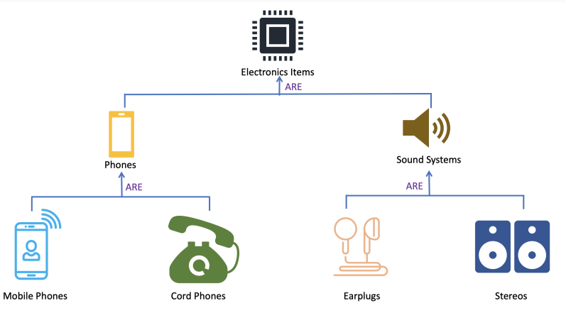

# CLOO notes

## Enumérations

## Généricité et variance

Apres avoir defini une simple classe, pendant l'appel d'une de ses methodes il est possible d'avoir un type different de celui voulu, il est donc
necessaire de tester les instances pour etre sur d'avoir le bon type. Ceci rajoute enormement de code non necessaire et on peut ce perdre facilement.

Viens alors les _generiques_ $\rightarrow$ rajoute une forme de polymorphisme par parametricite permettant d'ajouter un objet d'un certain type

Definition d'une classe avec un generique en Java:

```java
public class Stack<T> { // T n'est connu que a la compilation
...
}
// Declaration d'une stack de strings
Stack<String> stack = new Stack<String>();
```

Autre utilisation $\rightarrow$ Tableau dynamique:

```java
var l = new ArrayList<String>();
```

## Héritage et aggrégation

La plupart des implementations d'heritage sont abstraite $\rightarrow$ mauvaise pratique

- ### Heritage

  - extension d'une classe
  - Java: mot cle `extends`
  - Sous-Classe **herite** de tous les **membres** de sa Super-Classe qui ne sont **pas** `private`

```java
class Foo extemds Bar { /*... */ }
```
>
> - Foo sous-type de Bar
> - Foo recupere une partie des membre de Bar

---

- ### **Aggregation**

  - Membres d’une classe $\rightarrow$ aussi refs vers instances

## Héritage et polymorphisme

Un exemple classique est de parler d'un heritage structurel. Prenons par exemple l'exemple des systemes electroniques



---

### Mauvais Exemple: Probleme de l'ellipse

En geometrie, Circle $\rightarrow$ Ellipse

Un cercle devrait est donc un sous type de la classe Elllipse

- Probleme: le cercle herite des fonctions de modification de l'Ellipse qui modifie le Cercle comme une Ellipse
- Solutions (dans l'ordre du meilleur au pire):
  - Pas d'heritage (immutabilite si possible)
    - Avantage: Invariant decouples, Erreur de compilation au lieu d'exceptions, Generalisation a d'autres formes facile
    - Desavantage: Pas de code en commun: plus de code
  - Immutabilite
    - Avantage: Invariants respectes, Erreur de compilation au lieu d'exceptions
    - Desavantage: Immutable
  - Pas de Cercle
    - Avantages: Plus simple, Pas de surprise
    - Desavantage: Plus de methode specialisee pour les cercles, Indistinguable a la compilation
  - Exceptions
    - Avantage: Invariant respecte
    - Desavantages: Risque suplementaire d'exceptions a l'execution
  - Changer la fonction probleme
    - Avantage: Cerlce respecte
    - Desavantages: la fonction ne fonction pas comme sont nom l'indique $\rightarrow$ surprise + moins d'**encapsulation**

## Héritage: redéfinition des méthodes

$\rightarrow$ Mécanisme qui permet à une classe d’obtenir la structure et le comportement de la super classe

Toute classe $\rightarrow$ implémentation par défaut de plusieurs méthodes $\leftarrow$ **Object class hérédité**:

```java
public String toString();
```

```java
public boolean equals();
```

```java
public int hashCode();
```

$\rightarrow$ On peut redefinir une methode heritee.

Java:

- La reference `super` $\rightarrow$ acceder au methodes de la super classe
- Annotation `@Override` $\rightarrow$ redefinition d'un membre de la super classe
  - optionnelle
  - recommendé dans le cadre d'une extension de classe
  - Inutile dans le cas d'une implementation d'interface

## Identité et Égalité

- ### **Identite**

  - 2 Objets sont **identique** $\iff$ physiquement le m, c-a-d pointer au m endroit, m case memoire (addresse pas valeur)
  - Java: Opérateur `==` retourne vrai ssi les 2 refs pointent sur la m instance

---

- ### **Egalite**

  - 2 Obkjets sont **egaux** $\iff$ m valeurs
  - Methode `equals`
    - Par défaut $\rightarrow$ m effet que identite
    - Redéfinition $\rightarrow$ pour tester l'égalité entre valeurs

---

- ### **Code de hachage**

  - Valeur numérique calc pour chaque instance
  - Si `x.equals(y)` $\Rightarrow$ `x.hashCode()` = `y.hashCode()`
  - Redefinition `equals` $\Rightarrow$ redefinition hashCode
  - **Criteres**:
    - Aussi rapide que possible
    - m champs que `equals`
    - Repose sur appel à l'autre
    - Retourne des valeurs réparties sur `int`

---

- ### **Value Object vs Entity**

  - 2 types de Objects:
    - **Value Objects**: Definis par la valeur de leur champs
      - si m valeurs $\Rightarrow$ m objet
      - Egalite $\rightarrow$ Toujours redefinir `equals`
    - **Entity Objects**:
      - Definis par la structure de leur champs
      - m objet peut avoir des valeurs différentes au cours du temps
      - Identite
      - Gerer cycle de vie

## Lambda expressions

## Mutabilité et immutabilité

- **Par défaut** $\rightarrow$ tout est **mutable** [JAVA]
- Variable:

```java
int i = 12; // mutable
```

Mot cle `final`

- Rendre une variable/reference **immutable**
- Dans le cas d'une classe $\rightarrow$ ne peux pas etre etendue
- Methode $\rightarrow$ ne peut pas etre redefinie

```java
final int i = 12; //immutable
```

> Ne pourra jamais changer dans le futur

---

## Polymorphisme et interfaces

- ### Sous-Typage

  - T <: U <$\Rightarrow$ Tout les type de T sont des types de U
  - Si T <: U on peut assigner une valeur de type T à une ref de type U
  - Relation **transitive**
  - On peut assigner a une ref de type Object
    - Compilateur perd la trace du sous-jacent
  - Test du type sous-jacent d'une instance avec `instanceof` $\rightarrow$ a l'execution
  - Forcer la conversion d'un type a l'execution
    - Erreur de compilation si non $\iff$
      > tout combiner avec `if` pour proteger la conversion

---

- ### Polymorphisme

  - Plusieurs comportements -$\rightarrow$ unique symbol
    - ad-hoc $\rightarrow$ surchage
    - par sous-typage $\rightarrow$ interface
    - par parametricite

---

- ### Interface

  - Abstraction permettent d'exprimer des contraintes sur la presence de methode et signatures
  - sous-typage
  - forme de contract, analogue a un protocole de communication
  - syntaxe similaire a une classe:
    - methode abstraite $\rightarrow$ non implémentée
    - pas de champs
    - pas de membres prives
  - mot cle `implements`
  - doit implementer toutes les méthodes abstraites
  - **Limitations**:
    - pas de constructeur abstrait $\rightarrow$ il existe une _abstract factory_
    - pas de champs abstraits

---

- ### Fake It Till Make It

  - utilisation d'interface pour remplacer un composant pas encore ecrit
  - _mock implementation_ ou _dommy object_ en anglais, une fausse implementation pour les tests.

- ATTENTION AU EXCES

---

- ### Exceptions et Erreurs

  - **Throwable**
    - super type de toutes les exceptions et erreurs
  - **Error**
    - ne **doit pas** etre geree
    - problèmes graves dus a l’env:
      - manques de memoire
      - bug dans la JVM
      - etc…
  - **Exceptions**
    - **doit** etre geree
    - problèmes imprévisibles à gérer:
      - problèmes d’IO
      - time-out
      - _thread_ interrompu
  - **RuntimeException**
    - **peut** etre geree
    - liés à des erreurs de programmation:
      - dépassement de tableau
      - arg invalide
      - erreur de conversion
      - etc…

- ### Lever une exception

  - Pourquoi? $\rightarrow$ Anticiper un probleme
  - Java $\rightarrow$ mot cle `throw` suivi d’une instanciation de l’exception

- Important de creer un gestionnaire $\rightarrow$ dependace a des choses que l'on ne peut pas controler

- ### Gerer une exception (different comportements)

  - Terminer l'application
  - Journaliser ou notifier l'exception
  - Utiliser une valeur par default
  - Ressayer
  - Essayer un plan B
  - Lever une autre exception
  - Ignorer (mauvaise idee)

- **Gestionnaire d'exception Java**

  - 3 parties:
  
    1. Tentative d'execution de code $\rightarrow$ `try`
    2. Capture d'exceptions produite $\rightarrow$ `catch`
    3. (Optionel) Code execute dans tous les cas a la fin $\rightarrow$ toujours execute

---

- ### Problemes des exceptions

  - Plein de code partout pour gerer
  - Exception non attrapée $\rightarrow$ propagation et donc problemes
  - Comment faire?
    - Utiliser exceptionnellement
    - Anticiper le probleme
    - Utiliser le type retour
    - Ne pas utiliser pour la logique

## Principe de substitution de Liskov

Une relation _is-a_ entre 2 classes est **necessaire** mais pas **suffisante** pour que l'utilisation d'heritage soit coherante et sensee

Avant tout, il est important de savoir ce qu'est la programmation par contrat

---

### Programmation par contrat

Pour chaque operation, on peut definir des **contraintes**:

- **Pre-conditions** : Contraintes qui doivent etre realisees _avant_ d'effectier l'operation
  - Type des args $\rightarrow$ Java: compilateur
  - Valeur des args $\rightarrow$ verifier les valeurs
  - Etat de l'objet courant $\rightarrow$ ne pas pouvoir utiliser `write` sur un fichier fermé
- **Post-conditions** : Contraintes qui doivent etre realise _apres_ avoir effectue l'operation
  - Type de retour $\rightarrow$ Java compilateur
  - Valeur de retour
  - Etat de l'objet courant
  - Etat des args
- **Invariants** : contraintes toujours realisees. A la fois pre et post conditions
  - Valeur de l'objet courant

---

Viens alors le **principe de substitution de Liskov**:

- Si **S** est une sous classe de **T** $\rightarrow$ on doit pourvoir utiliser une instasnce **S** chaque fois qu'une instance de **T** est attendue, _sans causer de problemes_
- Pour toute sous-classe:
  - Les pre-conditions des methodes de la super classe ne peuvent eter durcies $\rightarrow$ ne peut pas rendre les conditions plus strictes
  - Les post-conditions des methodes de la super classe ne peuvent etre assouplies $\rightarrow$ conditions plus strictes possible
  - Les invariants de la super classe doivent etre preserves tels quels

Definition de Barbara Liskov:

- Soit $\phi$(x) une propriete prouvable a propos d'objets x de type T. Alors $\phi$(y) devrait etre vrai pour un objet y de type S ou S est un sous type de T

Contrairement a l'intuiation, la relation de sout-typage (is-a) n'implique pas une compatibilite de structure, mais de **comportement** $\rightarrow$ ne pas penser en structure mais en comportement

Le comportement depend du programme, donc la question de savoir si **Foo** est une sous classe de **Bar** ne peut etre tranchee sans avoir determine le comportement desire $\rightarrow$ seulement quand on connais le comportement exact on peut savoir si Foo est une sous classe de Bar

## Références et construction

- Inference de type:
- mot cle `var`
- privilegier la lisibilite $\rightarrow$ **pas abuser**

```java
var i = 12; // detection de type int
```

---

- ### Déclaration de tableau

  - Taille fixe
  - Init dans le tas (**heap**)
  - x est une reference
    - Similaire à un pointeur
  - **Garbage-Collector** $\rightarrow$ free la mémoire quand plus aucune références ne pointe sur un objet <$\Rightarrow$ `free()` en c

```java
int[] x = new int[12]; // tab of size 12 int
```

> Tableau vide

---

- ### **Encapsulation**

  - Approche consistant à cacher l'état et l'implémentation des données, derrière des fonction de plus haut
  - **Avantage**:
    - Plus evolutif
    - Plus reutilisable
    - Plus simple à apprendre
    - Plus testable
  - **Inconvenient**:
    - Plus difficile a optimiser

---

- ### Package

  - Regrouper les classes
  - Espaces de noms (**namespace**) pour éviter les collisions
  - Hierarchique

---

- ### Classes et instances

  - Definition: **Classe** $\rightarrow$ type compose [JAVA]
    - **Instance** $\rightarrow$ valeur d’une classe
    - **Objet** $\rightarrow$ instance ou classe
    - **Membre** $\rightarrow$ variable ou fonction déclarées
    - **Champ** $\rightarrow$ variable membre
    - **Méthode** $\rightarrow$ fonction membre
  - L’operateur `.` (**point**) permet d'accéder aux champs et méthodes d’une instance
  - **Constructeur**:
    - Construit l’instance
    - m nom que l’instance
    - Pas de return
    - Appelé après l’alloc de l’instance
    - **Surcharge** $\rightarrow$ plusieurs constructeurs
    - Pas de constructeurs $\Rightarrow$ un par défaut genere, vide
  - Reference **`this`**
    - Chaque instance a un accès vers elle m $\rightarrow$ `this`
    - Utilisation des membres localement cachés par autre variables
    - Lisibilite
    - Return instances de sois m
  - JAVA: Toutes classes derivent d'une autre classe $\rightarrow$ Object
    - 2 effets de derivation
      - sous-typage
      - heritage

```java
Point p = new Point(1.0, 0.5);
```

---

- ### Sémantique par référence

  - S’applique toujours au instances
  - cf. voir tableaux exemples

  - On peut définir plusieurs méthodes ou constructeurs avec le **m nom** dans la m classe si les **args sont différents** $\rightarrow$ **surcharge**

    > **m effet final**

## Références et passage d'argument

- ### Fonctions

```java
static type nom(parametres);
```

> - Aussi appelé méthode de classes

- L’appel de la fonction copie les arguments
  - modification aucun effet en dehors de la fonction
    > Exemple pas a pas $\rightarrow$ cours p.29-34

## Références, méthodes et mutabilité

- Considérer **immutabilité par défaut**
  - Plus simple a analyser
  - Moins de bugs
  - Thread safe
  - Plus facile de changer d’avis

## Visibilité et contrôle d'accès

Visibilite $\rightarrow$ propriété contextuel $\Rightarrow$ dépendante de l'endroit ou on se trouve. On peut voir certains attirbut a un endroit mais pas un autre

Contrôle d'accès $\rightarrow$ notion fortement liée à la visibilité $\Rightarrow$ ce qui ne peut pas etre vu, ne peut pas etre directement accedé

- ### Modificateurs d'accès

  - differents mots-clefs liés à la visibilité et à l'accès
  - Control d'accès des membres en Java:
    - `public` $\rightarrow$ accès/utilisation partout
    - `private` $\rightarrow$ acces/utilisation uniquement par les instances de la m classe
    - `default` $\rightarrow$ ($\iff$ aucun mot clé) accès/utilisation uniquement dans le m package
    - `protected` $\rightarrow$ accès/utilisation uniquement dans le m package ou est definie sa classe à l'exception d'une sous-classe de la classe de l'attribut.

- ### **Recommendations**

  - Tout champs $\rightarrow$ `private`
  - Moins de méthode `public` possible
  - Utilisation de methodes _getter_ et _setter_ pour recuperer des informations `private`

---

- Accès lecture (**getter**) et écriture (**setter**) $\rightarrow$ pratique **systématique déconseillées**:
  - Fuite des détails d'implémentation
  - Contraintes et coordination plus difficile
  - Synchronisation plus difficile
  - cf. [why getter and setter are evil](https://web.archive.org/web/20200729073721/https://www.infoworld.com/article/2073723/why-getter-and-setter-methods-are-evil.html)
- **Recommendations**:
  - retourner des _interfaces_ $\rightarrow$ cacher les details d'implementation
    - Plus simple a modifier si l'on decide de changer un type par exemple
