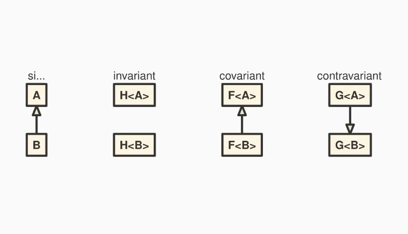

# Généricité et variance

## Généricité

Le **polymorphisme parametrique** permet d'ecrire des structures de donnees et des fonctions qui s'appliquent a plusieur types, sans perdre la **surete de typage**

- *java* $\Rightarrow$ **Generics**

Apres avoir defini une simple classe, pendant l'appel d'une de ses methodes il est possible d'avoir un type different de celui voulu, il est donc
necessaire de tester les instances pour etre sur d'avoir le bon type. Ceci rajoute enormement de code non necessaire et on peut ce perdre facilement.

Viens alors les *generiques* $\rightarrow$ rajoute une forme de polymorphisme par parametricite permettant d'ajouter un objet d'un certain type

Definition d'une classe avec un generique en Java:

```java
public class Stack<T> { // T n'est connu que a la compilation
// T est l'identifiant de type
// Ce n'est pas un type!!
...
}
// Declaration d'une stack de strings
// Ici String est bien le type String qu'on assigne a T
Stack<String> stack = new Stack<String>();
```

Autre utilisation $\rightarrow$ Tableau dynamique:

```java
var l = new ArrayList<String>();
```

Exemple de definition de methode generiques en *java* :

```java
public <T> void add(T t) { // Ajoute un element de type T
// T est l'identifiant de type
// void est le type de retour
...
}
```

Attention au redefinitions de type, il est possible de redefinir un identifiant de type deja existant ce qui cacherait un type deja defini le rendant inutile.

En *java*, les types sont definis par **erasure**

- compilateur $\rightarrow$ verifie toute contraintes liées aux types
  - types respectes $\rightarrow$ phase de typage
- Si tout dans l'ordre $\rightarrow$ efface les generiques
  - generiques n'existent plus au **runtime**
- Ajoute eventuellement le code necessaire (*type cast*)

Meilleurs performances $\rightarrow$ moins de verification au **runtime**

## Variance

La variance d'un type determine si un sous type peut etre utilise de maniere interchangeable avec ce meme type.

Il est existe plusieurs types de variance:

- *covariance*
- *contravariance*
- *invariant* $\rightarrow$ tout ce qui n'est pas variant

---

L'idee de variance est assez vague sans exemple donc voyons plus en detail avec *java*

On a que `ArrayList <: List` et `User` un type generique on a alors que User est

- **covariant** $\rightarrow$ `ArrayList<User> <: List<User>`
- **contravariant** $\rightarrow$ `ArrayList<User> :> List<User>`
- **invariant** $\rightarrow$ ni covariant ni contravariant

---

En *java* $\rightarrow$ les tableaux sont covariant

- Si `A <: B` $\rightarrow$ `A[] <: B[]`

$\rightarrow$ decision **catastrophique**

Quand aux **generiques** qui eux sont **invariants**

- Si `A <: B` alors
  - ni `F<A> <: F<B>`
  - ni `F<B> <: F<A>`

ne sont vrais, pour tout type `F<?>`

---

## Groupe generiques borne

En *java* on peut definir un groupe de generiques qui sont borne a un type donne pour expliquer des contraintes.

- On ajoute un mot cle `extends` au nom de la classe, on peut ajouter plusieurs types:

```java
public class Stack<T extends Number> {
// on aura ici tout les type T qui sont des numeriques
// ou sous-types de Number
...
}
// On peut utiliser & pour plusieurs types
<T extends U & V & W>
```

Il existe la **wildcard** `?` qui permet de definir un type generique qui peut etre n'importe quel type $\rightarrow$ rendre covariant

```java
List<? extends User>
```

- On utilise `super` pour definir un type generique qui est superieur a un type donne

```java
List<? super Admin> // Liste de n'importe quel supertype
```

Si on a `A <: B`, on va avoir une relation du type: (cf. [Liskov](subtitutionLiskov.md#variance))

- `F<A> <: F<? extends B>` $\rightarrow$ *producteur* (type de retour seulement)
- `F<B> <: F<? super A>` $\rightarrow$ *consomateur* (args seuelements)
- `F<T>` $\rightarrow$ *producteur-consommateur* (args et retour)

Mnemotechnique $\rightarrow$ **PECS** (Producer-Extends-Consumer-Super)

## Resume en graphe UML


