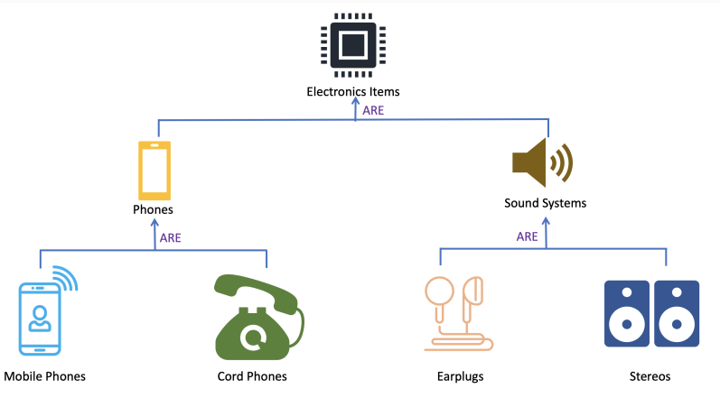

# Héritage et polymorphisme

Un exemple classique est de parler d'un heritage structurel. Prenons par exemple l'exemple des systemes electroniques

---

## Mauvais Exemple: Probleme de l'ellipse

En geometrie, Circle $\rightarrow$ Ellipse

Un cercle devrait est donc un sous type de la classe Elllipse

- Probleme: le cercle herite des fonctions de modification de l'Ellipse qui modifie le Cercle comme une Ellipse
- Solutions (dans l'ordre du meilleur au pire):
  - **Pas d'heritage** (immutabilite si possible)
    - $\textcolor{green}{\text{Avantage}}$: Invariant decouples, Erreur de compilation au lieu d'exceptions, Generalisation a d'autres formes facile
    - $\textcolor{red}{\text{Desavantage}}$: Pas de code en commun: plus de code
  - **Immutabilite**
    - $\textcolor{green}{\text{Avantage}}$: Invariants respectes, Erreur de compilation au lieu d'exceptions
    - $\textcolor{red}{\text{Desavantage}}$>: Immutable
  - **Pas de Cercle**
    - $\textcolor{green}{\text{Avantage}}$: Plus simple, Pas de surprise
    - $\textcolor{red}{\text{Desavantage}}$: Plus de methode specialisee pour les cercles, Indistinguable a la compilation
  - **Exceptions**
    - $\textcolor{green}{\text{Avantage}}$: Invariant respecte
    - $\textcolor{red}{\text{Desavantage}}$: Risque suplementaire d'exceptions a l'execution
  - **Changer la fonction probleme**
    - $\textcolor{green}{\text{Avantage}}$: Cerlce respecte
    - $\textcolor{red}{\text{Desavantage}}$: la fonction ne fonction pas comme sont nom l'indique $\rightarrow$ surprise + moins d'**encapsulation**
